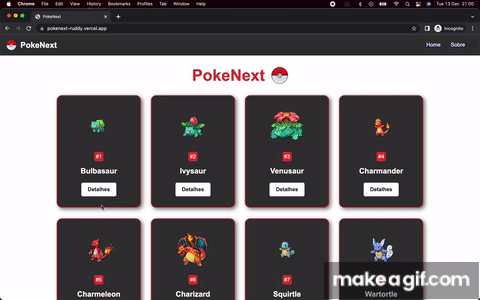

# PokeNext

This is a reinterpretation of the [pokedex](https://pokemon.fandom.com/pt-br/wiki/Pok%C3%A9dex) developed with [nextJS](https://nextjs.org/).

## 🔨 Project features

On one page, you have access to all pokemons of the second generation, bringing the breakdown of attributes of a pokemon by clicking on "details".

A Pokedex is an electronic device featured in the Pokémon game and anime series that serves as a digital encyclopedia for all known Pokémon species.

It contains detailed information about each Pokémon, such as its name, number in order of registration, type, abilities, battle stats, possible evolutions, location where it can be found, and other characteristics.

The [Tutorial of this application you can find here](https://www.youtube.com/watch?v=Zc0NrkoEqgI&ab_channel=MatheusBattisti-HoradeCodar).

## ✔️ Techniques and technologies used

Check out this list of everything we will use in this app:

- `NextJS`
- `TypeScript`
- `CSS Module`
- `Components`
- `Next Routes`
- `Vercel Deployment`
- `GitHub`

## 🛠️ Open and run the project

To open and run the project, run `npm i` to install the dependencies and `npm run dev` to start the project.

Then go to <a href="http://localhost:3000/">http://localhost:3000/</a> in your browser.

## 📚 More tutorial information

PokeNext is an application for pokemons consultation, developed from the tutorial [Matheus Battisti](https://www.youtube.com/@MatheusBattisti).
The main idea of ​​this tutorial implementation is to learn and develop the concepts of the nextjs framework, one of the current darlings in the market. The format of working with modular CSS is interesting, as css overlapping problems are stipulated. Individual item access is also different. I conclude that nextJs and SSR can be powerful, but needs to be trained a lot, especially when migrating. It resembles the react query.
